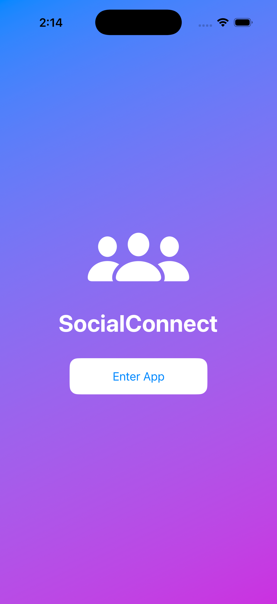
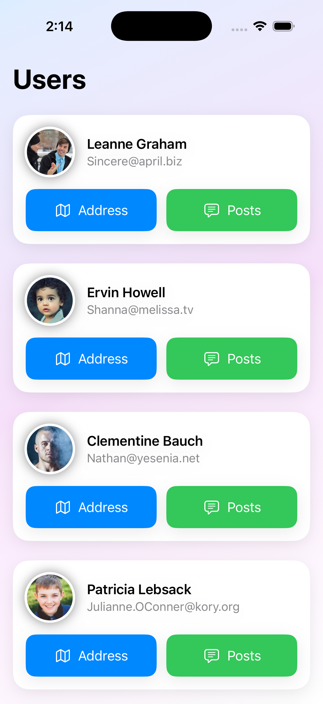
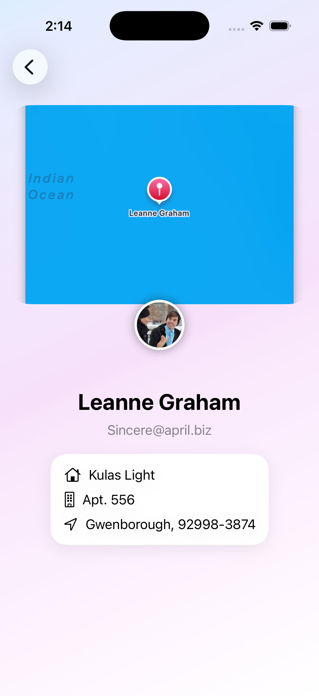
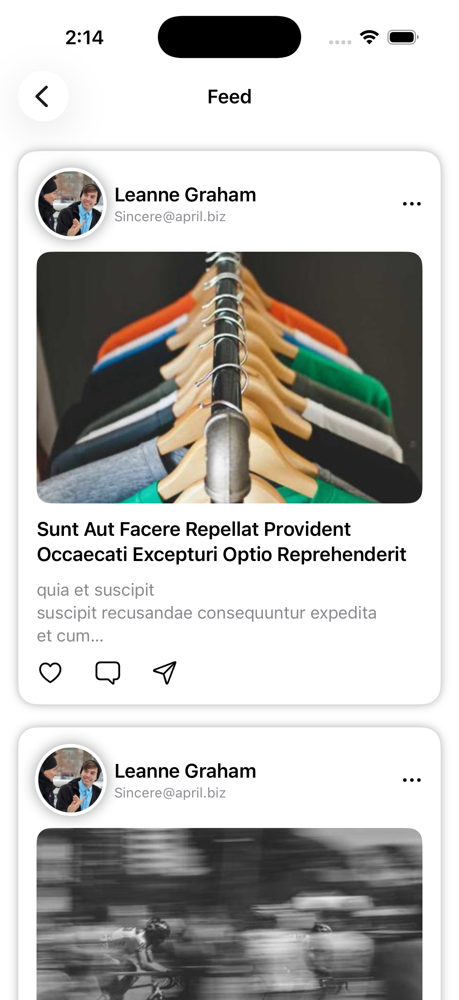
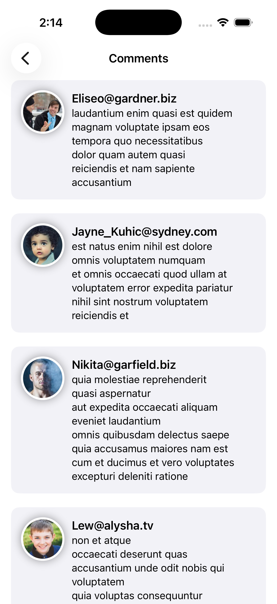

# 📱 SwiftUI Networking App

A simple yet structured iOS application built using **SwiftUI**, **MVVM architecture**, and a **generic networking layer with escaping closures**.

This is my **first iOS project**, built after starting my iOS development journey just **one month ago**. The goal of this project was to understand how networking, architecture, and UI work together in a real application.

---

## 🚀 Features

- 👤 **User List Screen**
  - Displays users fetched from an API
  - Clean and scrollable SwiftUI layout

- 📝 **Posts Screen**
  - Shows posts associated with each user
  - Structured feed-like layout

- 💬 **Comments Screen**
  - Displays comments related to posts
  - Dynamic loading of API data

- 🗺️ **Map Integration**
  - Displays user location using **MapKit**
  - Expandable map view

- ⚠️ **Error Handling**
  - Custom `NetworkError` enum
  - User-friendly error messages

- ⏳ **Loading State**
  - Activity indicators while data is being fetched

---

## 🧠 Architecture

This project follows the **MVVM (Model-View-ViewModel)** architecture.

### Components

**Models**
- `User`
- `UsersDets`
- `Comment`

**ViewModels**
- `EscapingViewModel`

**Networking Layer**
- `EscapingNetwork`
- Generic API function using `Decodable`

**Views**
- `ContentView`
- `UserView`
- `CommentsPage`
- `MapView`
- `AddressView`

---

## 🌐 API Used

Data is fetched from:

https://jsonplaceholder.typicode.com/

Endpoints used:

- `/users`
- `/posts`
- `/comments`

---

## 🛠 Tech Stack

- **Swift**
- **SwiftUI**
- **MVVM Architecture**
- **URLSession**
- **MapKit**
- **Generic Networking**
- **Escaping Closures**
- **Result Type**

---

## 📷 Screenshots

---

## 📚 What I Learned

While building this project I learned:

- How to create a **generic networking layer**
- How **escaping closures** work in Swift
- Using **Result type for API responses**
- Implementing **MVVM architecture**
- Handling **API errors properly**
- Building UI with **SwiftUI**
- Integrating **MapKit**

---

## 🎯 Future Improvements

- Add **async/await networking**
- Improve UI with **animations**
- Implement **image caching**
- Add **better feed-style UI**
- Implement **pagination for API data**

---

## 👩‍💻 Author

**Khushi Kukreja**

iOS Developer (Learning & Building)

---

⭐ If you found this project interesting, feel free to **star the repo**!
